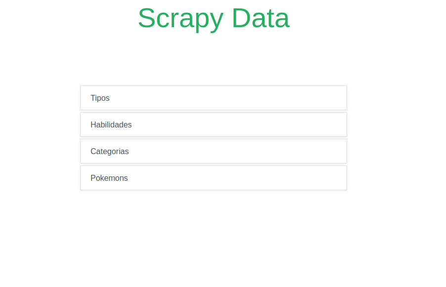

# pokedex-django (Inacabado)

## Um site para adicionar seus pokémons e favoritá-los

### Scrapy 
* https://pokemondb.net/pokedex/all 
* https://www.pokemon.com/br/pokedex/ 
* https://bulbapedia.bulbagarden.net/wiki/Pok%C3%A9mon_category

##### Para adquirir o código html e fazer o scrappy é usado as libs:
* BeautifulSoup
* Urllib

## Para gerenciar o banco de dados é usado:
* MySql
> Para usar MySql é preciso fazer o download do conector da linguagem python no site oficial

## Iniciar o scrapy
> Para iniciar o scrapy vá até a url http://localhost:8000/scrapy e aperte em uma das opções

###### Observações
> Verifique a estabilidade da sua internet, pois isto poderá ocasionar erros  
> Caso algum erro ocorra ou o programa entre em um loop, verifique sua conexão e tente novamente
